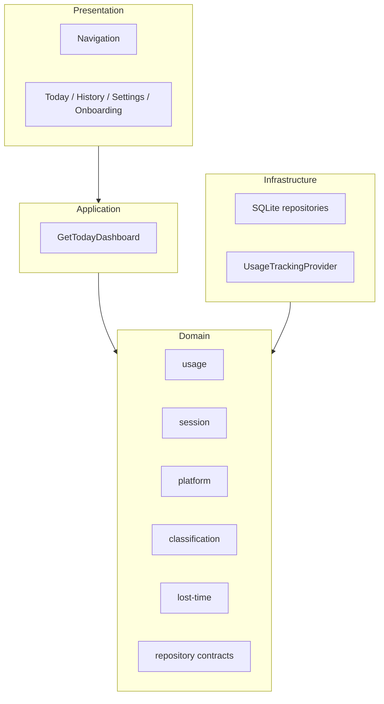

# Architecture overview

Lost Hours mobile code lives in `apps/mobile/src` and follows layered boundaries.

## Layer diagram

## Dependency rules

| Rule | Detail |
|------|--------|
| Domain purity | Domain does **not** import React Native, SQLite, or navigation. |
| Classification location | Classification runs in domain (`RuleBasedActivityClassifier`); **not** in storage or UI. |
| Lost Time | Calculated in domain (`DefaultLostTimeCalculator`); **not** in presentation. |
| Tracking | Providers return factual `UsageEvent` objects; they **do not** classify or persist sessions. |
| Storage | Repositories implement domain contracts; mappers validate enums on read. |

## Domain modules

| Module | Responsibility |
|--------|----------------|
| `platform` | `Platform` identity enum |
| `session` | `UsageSession`, analytics validity |
| `usage` | `UsageEvent`, `DailyUsageSummary`, `DefaultDailyUsageAggregator` |
| `classification` | Rules, context, `RuleBasedActivityClassifier` |
| `lost-time` | `LostTimeSummary`, `DefaultLostTimeCalculator` |
| `repositories` | Interfaces for sessions, rules, daily summaries |

## Infrastructure

| Module | Responsibility |
|--------|----------------|
| `infrastructure/storage/sqlite` | `lost_hours.db`, migrations, SQLite repositories |
| `infrastructure/tracking` | `UsageTrackingProvider`, mock/Android TypeScript adapters |

## Application

| Module | Responsibility |
|--------|----------------|
| `application/queries/GetTodayDashboard` | Composes aggregator + Lost Time calculator into `TodayDashboardModel` |

## Presentation

| Module | Responsibility |
|--------|----------------|
| `app/navigation` | Root stack + bottom tabs |
| `features/*` | Screens (dashboard demo, history/settings placeholders, onboarding) |
| `shared` | Reusable UI helpers, duration formatting |

## Related documents

- [Data flow](data-flow.md)
- [Classification](classification.md)
- [Storage](storage.md)
- [Tracking](tracking.md)
- [Domain README](../../apps/mobile/src/domain/README.md)
